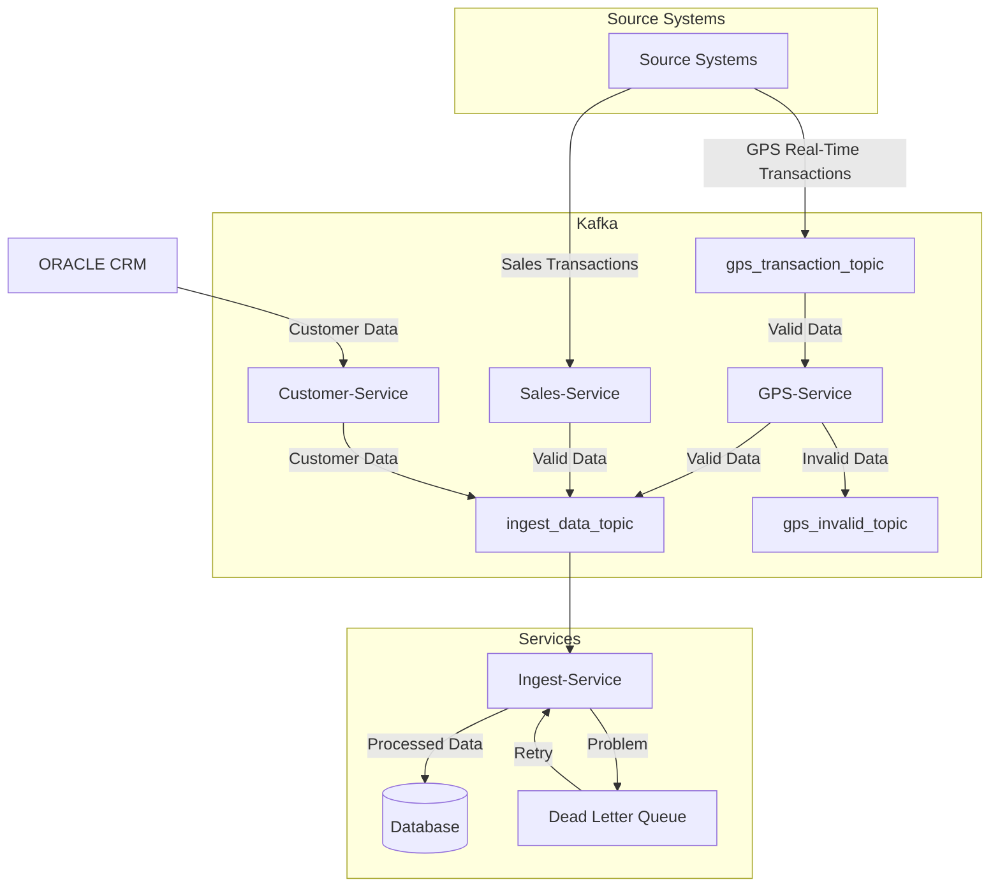
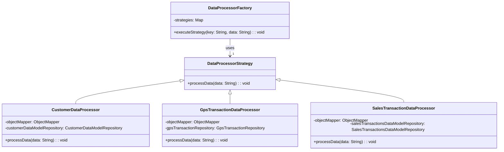
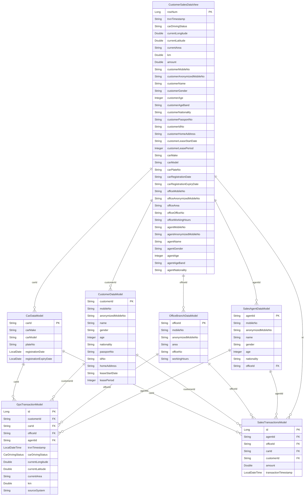

# Real-Time Streaming Engine for Analytics

This project involves designing and implementing a real-time streaming engine that processes millions of records with minimal latency. The engine handles data ingestion, enrichment, anonymization, and filtration to generate real-time analytics and insights.

## Tech Stack
- **Java**
- **Spring Boot**
- **Apache Kafka**
- **H2 Database**

## Design Pattern
- **Strategy Design Pattern**

## Architecture

### Important points to consider:

When designing real-time streaming analytics applications, consider the following key aspects to ensure optimal performance and reliability:

## 1. Distributed Data Complexity

- **Objective:** Efficiently handle and analyze distributed data.
- **Considerations:**
    - Ensure data is well-organized and accessible to facilitate effective analytics.
    - Be aware of the resource and cost implications of constructing analytical views from distributed data.

## 2. Stream Data and Data Upsert Limitations

- **Objective:** Manage data streaming and upserts efficiently.
- **Considerations:**
    - Implement robust mechanisms to handle streaming data and upserts to minimize data loss.
    - Address potential performance issues and slower speeds compared to direct data insertion.

## 3. Independent Service Scalability

- **Objective:** Ensure services can scale independently and efficiently.
- **Considerations:**
    - Design services to scale individually, avoiding performance impacts on the database or other components.
    - Reduce service interdependencies to minimize unnecessary API calls for data analytics and reporting, maintaining overall system performance.

## Summary

Based on the above points the below architecture is designed and built.

### Data Flow

### GPS Transactions
- **Ingestion**: Data from GPS devices is ingested into `gps_transaction_topic`.
- **Processing**: The GPS Service processes and cleans the data and validates the schema
    - **Valid Data**: Sent to `ingest_data_topic`.
    - **Invalid Data**: Sent to `gps_invalid_topic`.

### Sales Transactions
- **Ingestion**: Sales data is received by the Sales Service.
- **Processing**: The Sales Service cleans the data.
    - **Cleaned Data**: Sent to `ingest_data_topic`.

### Customer Data
- **Fetching**: Customer data is fetched from the Oracle CRM system by the Customer Service.
- **Processing**: The Customer Service processes the data.
    - **Processed Data**: Sent to `ingest_data_topic`.

### Data Ingestion
- **Reading**: The Ingest Service reads data from `ingest_data_topic`.
- **Processing**: The Ingest Service processes the data.
    - **Successful Processing**: Writes data to the database.
    - **Error Handling**: If issues are encountered, the data is written to a Dead Letter Queue (DLQ) for retries.

## Use of Strategy Design Pattern (Design Pattern)

### Overview

The Strategy Design Pattern is used to define a family of algorithms, encapsulate each one, and make them interchangeable. This pattern allows the algorithm to vary independently from clients that use it.

### Implementation

- **DataProcessorStrategy**: Interface defining the data processing method.
- **CustomerDataProcessor**: Implementation of `DataProcessorStrategy` for processing customer data.
- **GpsTransactionDataProcessor**: Implementation of `DataProcessorStrategy` for processing GPS transaction data.
- **SalesTransactionDataProcessor**: Implementation of `DataProcessorStrategy` for processing sales transaction data.
- **DataProcessorFactory**: Executes the appropriate strategy based on the data type.

### Advantages

1. **Flexibility and Scalability**:
    - By encapsulating data processing logic within individual strategies, we can easily extend the system with new data processors without modifying existing code. This enhances the flexibility and scalability of the application.

2. **Code Maintenance**:
    - Each data processing type is handled by a specific class implementing the `DataProcessorStrategy` interface, leading to cleaner, more maintainable code. This separation of concerns makes it easier to manage and update the codebase.

3. **Independent Service Operation**:
    - Each service (CustomerDataProcessor, GpsTransactionDataProcessor, SalesTransactionDataProcessor) can operate independently. This reduces the risk of one service's performance issues impacting others, ensuring robust and reliable operation.

4. **Modular Design**:
    - The use of the Strategy pattern supports a modular design, making it simpler to test individual components. This modularity facilitates better unit testing and debugging, improving overall software quality.

5. **Reduction in Coupling**:
    - The Strategy pattern reduces the coupling between the context class and the strategies, making the system more adaptable to change. This decoupling is particularly important for systems that require frequent updates or modifications.

By leveraging the Strategy Design Pattern, we achieve a more flexible, maintainable, and scalable architecture for our real-time streaming engine.

# Batch Import Functionality

In addition to real-time streaming analytics, the application supports batch data import to handle large volumes of data efficiently. The following components are implemented for managing batch imports:

## PostProcessingApplication

- **Purpose:** Manages batch import services for various data types.
- **Responsibilities:** Coordinates the execution and management of batch import operations.

## Batch Import Services

- **CarDataBatchImportService:** Handles the import of car data.
- **OfficeBranchDataBatchImportService:** Manages the import of office branch data.
- **SalesAgentDataBatchImportService:** Facilitates the import of sales agent data.

## Repositories

- **Purpose:** Interfaces for data persistence.
- **Responsibilities:** Define the methods for saving and retrieving imported data to and from the database.

These components work together to ensure efficient and reliable batch processing of data, complementing the real-time streaming capabilities of the application.

### Entity Relationship Diagram

### Use Case Handled based on requirment:

## Data Encryption

- **Encryption Algorithm:** SHA-256
- **Data to Encrypt:**
    - Phone numbers in Customer, Office Branch, and Sales Agent entities.

## Data Export
- **Data based on the requirement are exported:**

## Aggregation Endpoints

## `/querybycity`
- **Description:** Aggregates data based on the current area.
- **Purpose:** Retrieves aggregated information specific to the queried area.

## `/countstatusbyarea`
- **Description:** Aggregates car driving status by area.
- **Purpose:** Provides aggregated data on car driving status across different areas.

## `/salescount`
- **Description:** Aggregates sales count data.
- **Purpose:** Returns aggregated sales count data, broken down by year and month.

